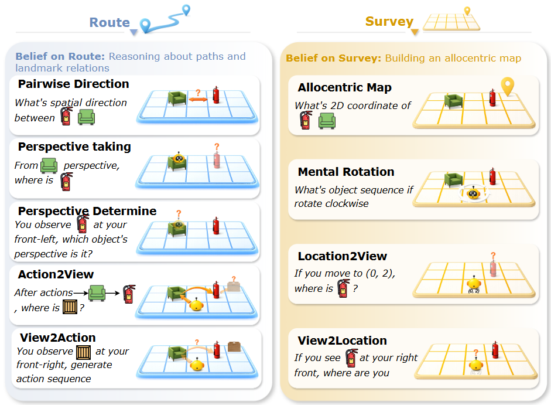

<h1 align="center">Theory of Space: Can foundation models construct spatial beliefs through active perception?</h1>
<p align="center" style="font-size: 16px;">
  Pingyue Zhang*, Zihan Huang*, Yue Wang*, Jieyu Zhang*,Letian Xue, Zihan Wang, Qineng Wang, Keshigeyan Chandrasegaran, Ruohan Zhang, Yejin Choi, Ranjay Krishna, Jiajun Wu, Li Fei-Fei, Manling Li
</p>
<p align="center" style="font-size: 12px;"><i>(* equal contribution)</i></p>

## Introduction
This repository contains the official implementation of our paper, Theory of Space: Can foundation models construct spatial beliefs through active perception?

To build agents with spatial intelligence, we argue for evaluating not merely passive reasoning, but the active, self-directed construction of spatial belief from partial observations. We introduce **Theory of Space (ToS)**, a conceptual counterpart to Theory of Mind (ToM). While ToM models hidden mental states of others, ToS models uncertain, currently unobserved structure of space.


Standard multimodal foundation models, despite their strong performance on passive tasks, struggle with embodied intelligence in multi-turn environments due to:

1.  **Passive Reasoning vs. Active Exploration**: For humans, active exploration constructs a mental map through movement, while current models often rely on passive reasoning from static views. This makes them ill-equipped for handling partial observations and uncertainty.
2.  **Information Acquisition Gap**: Current models do not yet reliably decide what to observe next to reduce uncertainty. They lack the ability to actively acquire information through self-directed exploration.
3.  **Spatial Belief Management**: There is a critical need for agents to construct, update, and exploit a **globally consistent spatial belief** of unobserved structures derived from sequential, partial observations.

**ToS** provides a benchmark to evaluate these capabilities by shifting the focus from specific task performance to assessing the quality of the underlying spatial model itself through curiosity-driven exploration.

## Evaluation Tasks


Theory Of Space task suite covering route-level egocentric reasoning and survey-level
allocentric mapping. Route tasks evaluate path-based inference and egocentric observations. Survey
tasks test global mapping, geometric transformation, and perspective conversion. Together they
cover both local navigation reasoning and global spatial abstraction.


## Setup (run everything)
Run `setup.sh` to install deps, download data into `room_data/3-room/`, and run the default experiment (a subset of 10 runs). You can set API keys in the script.
```bash
bash setup.sh
```

## Model configuration

To add a new model, edit `scripts/SpatialGym/base_model_config.yaml` and add an entry under the `models` section. Each model requires specific parameters based on its provider:

### OpenAI Models
```yaml
models:
  gpt-5.2:
    provider: openai # API provider (`openai`, `anthropic`)
    model_name: gpt-5.2 # Model identifier used by the API
    max_completion_tokens: 32768 # Maximum tokens for response
    temperature: 1.0 # Sampling temperature
    max_workers: 128 # Maximum parallel API calls
    max_retries: 5 # Retry rounds for batch requests
    max_retries_api: 5 # Retry attempts per API request
    timeout: 500 # Request timeout in seconds
    reasoning_effort: medium # Reasoning effort (low, medium, high)
```

### VLLM Models
First run the following command to serve the model:
```bash
vllm serve Qwen/Qwen3-VL-2B-Instruct \
  --host 0.0.0.0 \
  --port 9999 \
  --dtype bfloat16 \
  --served-model-name qwen3-vl-2b-instruct \
  --max_model_len 128000 \
```

Then add the following entry to `scripts/SpatialGym/base_model_config.yaml`:
```yaml
  qwen3-vl-2b-instruct:
    provider: openai
    organization: self-hosted
    model_name: qwen3-vl-2b-instruct # same as served-model-name in vllm serve command
    base_url: http://localhost:9999/v1 # same as host and port in vllm serve command
    max_completion_tokens: 8192
    temperature: 0.0
    max_workers: 16
    max_retries: 3
    timeout: 600
```
  
For other models, you can refer to the `scripts/SpatialGym/base_model_config.yaml` for more details.


## Commands
Run a single full pipeline (explore + eval + optional cogmap):
```bash
python scripts/SpatialGym/spatial_run.py \
  --phase all \
  --model-name gpt-5.2 \
  --num 25 \ # 25 samples (run00 - run24)
  --data-dir room_data/3-room/ \
  --output-root result/ \
  --render-mode vision,text \ # run both vision and text world
  --exp-type active,passive \ # run both active and passive exploration
  --cogmap \ # run cognitive map evaluation
  --false-belief-exp \ # run false belief experiment
```
See `scripts/SpatialGym/README.md` for more commands.


## Output Structure

Results are organized as:
```
{output_root}/
└─ {model_name}/
   └─ {room_hash}/
      └─ {render_mode}/
         └─ {exp_type}/
            └─ {think|nothink}/
               ├─ config.json
               ├─ exploration.json
               ├─ evaluation.json
               ├─ images/
               └─ [proxy_agent]/            # only when exp_type = passive
                  ├─ config.json
                  ├─ exploration.json
                  ├─ evaluation.json
                  └─ images/
```


